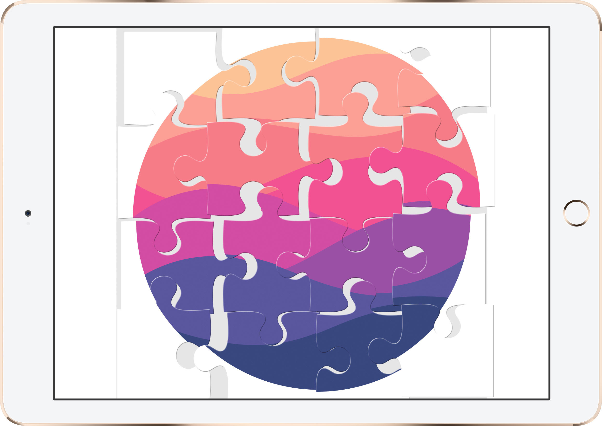

# Realm Puzzle
> A Collaborative Puzzle Game, powered by the Realm Mobile Platform

This app is a simple implementation of a team game. Multiple players simultaneously work together to solve a jigsaw puzzle on a shared canvas. Whenever one player moves a piece, all players see the piece move in real-time.



## Features

- [x] Allows users to collaborate in solving a jigsaw puzzle together.
- [x] Puzzle can be reset by tapping the screen with 3 fingers, 3 times.
- [x] Can connect to any running instance of Realm Mobile Platform

## Requirements

- iOS 9.0 and above
- Xcode 8.3

## Setting Up Realm Mobile Platform

In order to properly use Realm Puzzle, an instance of the Realm Object Server must be running for which each client copy of the app can connect.

* The [macOS version](https://realm.io/docs/get-started/installation/mac/) can be downloaded and run as a `localhost` on any desktop Mac.
* The [Linux version](https://realm.io/docs/get-started/installation/linux/) can be installed on a publicly accessible server and accessed over the internet.

## Installation

[CocoaPods](http://cocoapods.org/) is required in order to install all of the third party dependencies (such as Realm itself) into Realm Puzzle.

1. If you haven't already, [install CocoaPods](https://guides.cocoapods.org/using/getting-started.html).
2. Open Terminal, and navigate to the root Realm Puzzle directory, e.g. `cd ~/Projects/realm-puzzle`.
3. Run `pod install` to install the necessary dependencies needed by Realm Puzzle.
4. Open `RealmPuzzle.xcworkspace` instead of the `xcproject` file.

## Connecting to the Realm Mobile Platform
When launching the app each time, you'll be presented with a login form in order to connect to the right Realm Object Server instance.


For the server URL field, you may simply enter `localhost` if you're running out of the iOS Simulator with the Realm Object Server at the same time. For iOS devices running on the same network as that Mac, you can alt-click on the Wi-Fi icon in the macOS status bar to get the Mac's local IP address. You can then manually enter this into the server URL field on the iOS device.

You'll be required to create an admin account the first time you run an instance of the Realm Object Server. You may use this account when logging into Realm Puzzle by entering in the same username/password pair. Alternatively, you may also register new user accounts from the form by tapping the 'Register a new account' button.

## App Architecture
The data model behind Realm Puzzle is quite simple. There are 2 Realm object subclasses: `RLMPuzzle` and `RLMPuzzlePiece`.

```objc
@interface RLMPuzzle : RLMObject

@property NSInteger uuid;
@property RLMArray<RLMPuzzlePiece> *pieces;

@end

//---

@interface RLMPuzzlePiece : RLMObject

@property NSInteger identifier;
@property double x;
@property double y;

@end

RLM_ARRAY_TYPE(RLMPuzzlePiece)
```

`RLMPuzzle` represents a discrete puzzle session, and contains a list of puzzle piece objects. `RLMPuzzlePiece` represents a single puzzle piece on the board, and holds the X and Y coordinates of its position on the board.

Upon launching for the first time and starting a new session, a `RLMPuzzle` object is created. After that, 16 Realm `RLMPuzzle` instances, one representing each piece on the board are created and saved to Realm. These objects only store the ID reference of the puzzle piece they represent (Referenced in an enum), and the XY coordinate of the puzzle piece.

Whenever the user taps and drags a puzzle piece, for each frame of movement, a Realm write transaction is performed that writes the new XY coordinate to the Realm file.

These new coordinates are then synchronized via the Realm Mobile Platform. A global `RLMRealm` change notification block is registered, and whenever a change occurs, all puzzle pieces positions are refreshed.

## 3rd Party Dependencies

The following modules will be installed as part of the CocoaPods installation:

- [RealmSwift](https://realm.io) - The Realm bindings for Cocoa/Swift.

- [Realm LoginKit](https://github.com/realm-demos/realm-loginkit) - A Realm control for logging in to Realm servers.

## Contributing

See [CONTRIBUTING.md](CONTRIBUTING.md) for more details!

This project adheres to the [Contributor Covenant Code of Conduct](https://realm.io/conduct/). By participating, you are expected to uphold this code. Please report unacceptable behavior to [info@realm.io](mailto:info@realm.io).

## License

Distributed under the MIT license. See ``LICENSE`` for more information.
